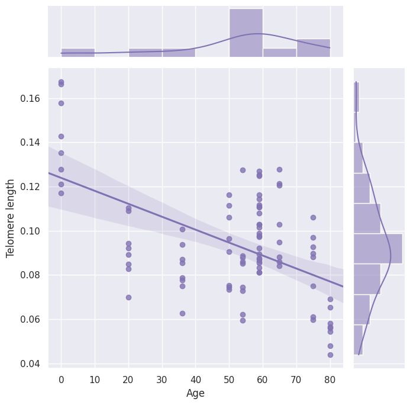

# Welcome to Telemere-length-calculation!

{ align=right width=300 }

The repository was used to contain tutorials of telemere length calculation for single cell DNA-seq data. It represents my work completed in July and August 2025 at the [School of Eecology and Environment](https://see.nwpu.edu.cn/), [Northwestern Polytechnical University](https://www.nwpu.edu.cn/), supervised by **Prof. [Wen Wang](https://teacher.nwpu.edu.cn/0147C7EFF01849A49FF04A590BCCBC58.html)** and **Prof. [Ruiwen Zhang](https://teacher.nwpu.edu.cn/2025010081.html)**.

To get started with this tutorials, check out the Tutorials.

For more details about the tutorials, please feel free to contact me.

## Contact

- Fenglei Zhang ([zhangfenglei2001@163.com](mailto:zhangfenglei2001@163.com), or [zhangfenglei@mail.nwpu.edu.cn](zhangfenglei@mail.nwpu.edu.cn))

