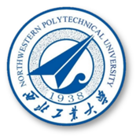

# Telemere-length-calculation
The repository was used to contain tutorials of telemere length calculation for single cell DNA-seq data. It represents my work completed in July and August 2025 at the [School of Eecology and Environment](https://see.nwpu.edu.cn/), [Northwestern Polytechnical University](https://www.nwpu.edu.cn/), supervised by **Prof. [Wen Wang](https://teacher.nwpu.edu.cn/0147C7EFF01849A49FF04A590BCCBC58.html)** and **Prof. Ruiwen Zhang**.

